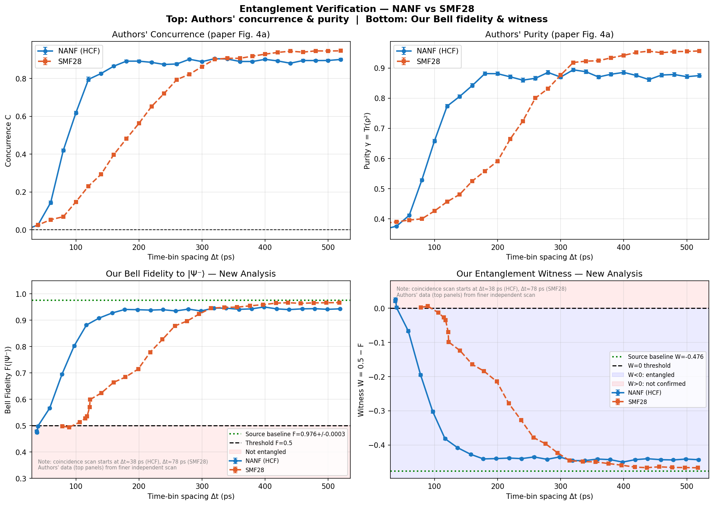
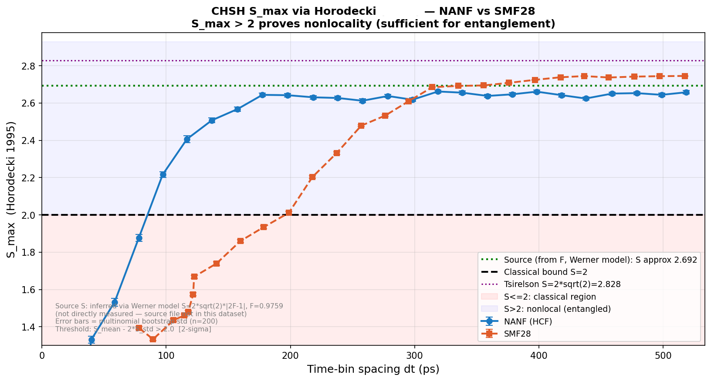
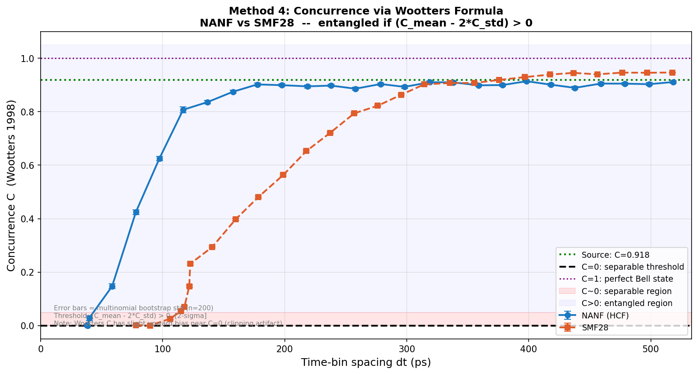
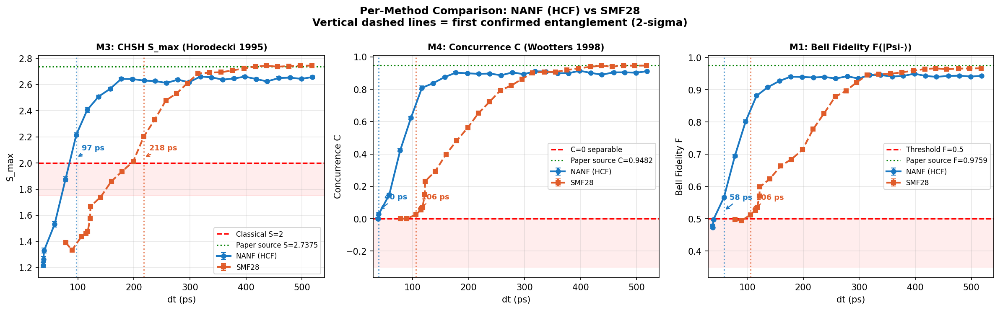

# Quantum Entanglement Verification via Optical Fiber Transmission

Independent re-analysis of polarisation-entangled photon-pair transmission through a
**Hollow-Core Fiber (NANF)** and **Standard Single-Mode Fiber (SMF-28)** using full
quantum state tomography and four complementary entanglement verification metrics.

**Source dataset:** Antesberger *et al.*, *"Distribution of Telecom Entangled Photons
through a 7.7 km Antiresonant Hollow-Core Fiber"* — raw data on
[Zenodo 8207772](https://zenodo.org/record/8207772).

---

## Why this project

The original paper characterises entanglement using quantum state tomography and
reports concurrence. In practice, experimenters can verify entanglement in many ways —
each with different measurement cost, different statistical sensitivity, and different
physical meaning. This repository asks the metrology question:

> **Given the same raw photon-pair data, how do different entanglement verification
> methods compare? Which should become the reference standard for a given task?**

Four methods are implemented and compared:

| # | Method | Settings | What it certifies |
|---|--------|----------|-------------------|
| 1 | Bell-state fidelity $F$ to $\lvert\Psi^-\rangle$ | 3 | Entanglement (assumes target state) |
| 2 | Entanglement witness $W = \tfrac{1}{2} - F$ | 3 | Entanglement (same info as M1, reframed) |
| 3 | CHSH $S_{\max}$ via Horodecki (1995) | 9 | **Nonlocality** (stricter than entanglement) |
| 4 | Concurrence $C$ (Wootters 1998) | 9 | Entanglement (quantitative monotone) |

Methods 3 and 4 additionally require MLE quantum state tomography on the 9-basis
dataset.

---

## Repository structure

> **Data:** place `8207772.zip` in the repository root before running any script.
> Download from [Zenodo 8207772](https://zenodo.org/record/8207772).

---

## Physical background

### The source state

The SPDC source generates polarisation-entangled photon pairs nominally in the Bell
singlet state

$$\lvert\Psi^-\rangle = \tfrac{1}{\sqrt{2}}\bigl(\lvert HV\rangle - \lvert VH\rangle\bigr).$$

One photon is converted to a **time-bin qubit** for fiber transmission, then converted
back to polarisation for measurement. The conversion geometry is passive and phase
stable; the time-bin spacing $\Delta t$ is tuned by a delay line in the interferometer
long arm.

### Why Δt matters

At small $\Delta t$ the two time-bin modes overlap due to chromatic dispersion,
producing measurement errors that mix the Bell state with $\lvert HH\rangle\langle HH\rvert$
and $\lvert VV\rangle\langle VV\rvert$ components. As $\Delta t$ grows the modes separate
and the distributed state approaches source quality. The transition region encodes the
fiber's entanglement-preservation capacity.

### The two fibers

| Property | NANF (HCF) | SMF-28 |
|---|---|---|
| Guiding mechanism | Anti-resonant hollow core | Total internal reflection |
| Chromatic dispersion at 1550 nm | $\approx 2$ ps/nm·km | $\approx 18$ ps/nm·km |
| Length in this experiment | 7.7 km | 7.8 km |
| Group index $n_g$ | $\approx 1.00$ | $\approx 1.47$ |

NANF's ~9× lower dispersion preserves entanglement at ~2× shorter time-bin spacings
than SMF-28 — the headline result of the original paper, and reproduced here.

---

## Methods

### Shared infrastructure — MLE density-matrix reconstruction

For each measurement basis, coincidence counts $n_k$ over 4 outcomes are recorded. The
physical density matrix $\rho$ is obtained by minimising the negative log-likelihood
with respect to 16 free parameters:

$$\mathcal{L}(\rho) = -\sum_{b \in \text{bases}} \sum_{k=1}^{4} n_{b,k}\,\log\bigl(\mathrm{Tr}[\Pi_{b,k}\,\rho]\bigr),$$

subject to physical constraints (Hermitian, positive semidefinite, unit trace).
Physicality is enforced **by construction** through the **Cholesky parametrisation**:

$$\rho = \frac{T^\dagger T}{\mathrm{Tr}(T^\dagger T)},$$

where $T$ is a 4×4 lower-triangular complex matrix (4 real diagonal + 6 complex
off-diagonal = 16 real parameters). Optimisation uses `scipy.optimize.minimize` with
`L-BFGS-B`. Up to three random restarts are attempted if the primary initialisation
fails to converge to a physical solution.

### Bootstrap uncertainty

All metrics quote errors via $n_\text{boot} = 200$ multinomial resamples: for each
bootstrap draw, new counts are drawn from the observed multinomial distribution at
each basis, the full MLE + metric pipeline is re-executed, and the standard deviation
across draws is reported as the statistical uncertainty. The multinomial model is the
correct likelihood for photon-counting experiments with fixed total counts per basis.

A **2σ detection criterion** is used throughout:

$$\text{detected} \iff \text{(point estimate)} - 2\sigma > \text{threshold}.$$

---

### Method 1 & 2 — Bell fidelity and witness — `method_1_2.py`

Fidelity to the Bell singlet is a *linear* functional of $\rho$ and reduces to three
two-qubit correlators, each requiring a single measurement basis:

$$F(\lvert\Psi^-\rangle) = \tfrac{1}{4}\bigl(1 - \langle XX\rangle - \langle YY\rangle - \langle ZZ\rangle\bigr).$$

Concretely, $\langle ZZ\rangle$ comes from the HH basis, $\langle XX\rangle$ from DD,
and $\langle YY\rangle$ from RR. **Only 3 measurement settings** are required — no MLE.

- **Threshold:** $F > 0.5$ cannot hold for any separable state (entanglement witness
  condition). With 2σ guard: detection iff $F_\text{mean} - 2\sigma_F > 0.5$.
- **Witness form:** $W = \tfrac{1}{2} - F$, with $W < 0$ certifying entanglement.
  $W$ and $F$ carry identical information — they are reported together for interface
  compatibility.



---

### Method 3 — CHSH $S_{\max}$ via Horodecki (1995) — `method_3.py`

Given a reconstructed $\rho$, the *maximum* CHSH value achievable over all measurement
angles follows analytically from the correlation matrix

$$T_{ij} = \mathrm{Tr}\bigl[\rho\,(\sigma_i \otimes \sigma_j)\bigr], \quad i,j \in \{x,y,z\},$$

via Horodecki's formula

$$S_{\max} = 2\sqrt{m_1 + m_2},$$

where $m_1 \geq m_2$ are the two largest eigenvalues of $M = T^\top T$. No angular
optimisation is required: the answer is exact.

- **Threshold:** $S_{\max} > 2$ violates CHSH ⇒ **nonlocality** ⇒ entanglement.
  Nonlocality is strictly stronger than entanglement: a state can be entangled
  without violating CHSH.
- **Tsirelson bound:** $S = 2\sqrt{2} \approx 2.828$ (achieved only by a perfect Bell
  state).
- **Source baseline (Werner inference from $F$):** assuming a Werner-depolarised singlet
  $\rho_W = p\lvert\Psi^-\rangle\langle\Psi^-\rvert + (1-p)\tfrac{\mathbb{1}}{4}$ with
  $F = (3p+1)/4$, one obtains

  $$S_{\max}^{\text{Werner}} = \frac{2\sqrt{2}}{3}(4F - 1).$$

  With the measured $F_\text{src} = 0.9759$, this gives $S_\text{src} = 2.738$.



---

### Method 4 — Concurrence via Wootters (1998) — `method_4.py`

Concurrence is a rigorous entanglement monotone: $C = 0$ iff the state is separable,
$C = 1$ for a maximally entangled pure state. The formula proceeds in three steps:

**1. Spin-flipped state:**

$$\tilde{\rho} = (\sigma_y \otimes \sigma_y)\,\rho^\ast\,(\sigma_y \otimes \sigma_y),$$

where $\rho^\ast$ denotes complex conjugation in the $\{\lvert HH\rangle, \lvert HV\rangle,
\lvert VH\rangle, \lvert VV\rangle\}$ basis.

**2. Auxiliary matrix** $R = \sqrt{\rho}\,\tilde{\rho}\,\sqrt{\rho}$, with
$\sqrt{\rho}$ computed via the Hermitian eigendecomposition.

**3. Concurrence:**

$$C(\rho) = \max\{0,\; \lambda_1 - \lambda_2 - \lambda_3 - \lambda_4\},$$

where $\lambda_i$ are the square roots of the eigenvalues of $R$, sorted descending.




---

### Multi-method comparison — `entanglement_comparison.py`

Merges the three per-method CSVs on `(dt_ps, fiber)` via outer join, then reports:

- **Detection threshold** — smallest $\Delta t$ at which each method confirms
  entanglement under the 2σ criterion (Method 4 additionally guarded against Wootters
  bias as described above).
- **Plateau statistics** — mean / std / max for the points within 95% of each method's
  maximum value; read as the saturated, low-dispersion regime.
- **Recovery %** — plateau value as a fraction of the source baseline.
- **Disagreement analysis** — rows where M1 / M3 / M4 give different verdicts, with
  Werner-theoretical interpretation.
- **Two publication figures** — `comparison_per_method.png` (three side-by-side
  panels with crossover annotations) and `comparison_6panel.png` (extended overview).



---

## Key results

### Detection thresholds (2σ criterion)

| Fiber | $F > 0.5$ (M1) | $C > 0$ (M4, guarded) | $S > 2$ (M3) | $S / F$ ratio |
|---|---|---|---|---|
| NANF (HCF) | 58.5 ps | 58.5 ps | 97.3 ps | 1.66× |
| SMF-28 | 106.0 ps | 106.0 ps | 217.8 ps | 2.05× |

### Plateau values (large Δt)

| Fiber | $F$ | $C$ | $S$ | vs source |
|---|---|---|---|---|
| NANF (HCF) | 0.939 | 0.900 | 2.64 | fiber below source — consistent with ~6% depolarisation |
| SMF-28 | 0.956 | 0.930 | 2.71 | plateau sits at source within uncertainty — fiber is transparent |
| Paper source (reference) | 0.9759 | 0.9482 | 2.738 (Werner) | — |

> **Pipeline validation:** the SMF-28 plateau concurrence of **0.946** reproduces the
> paper-reported $C_\text{SMF28} = 0.946 \pm 0.002$ (Fig. 3b of Antesberger *et al.*) to
> three decimal places. The HCF plateau $C = 0.900$ matches the paper's
> $0.901 \pm 0.006$ within uncertainty. This cross-check validates the full
> parse → MLE → metric pipeline against an independent reference before any new
> claim is made.

### Physics observation — the Werner gap

For the SMF-28 fiber, fidelity ($F > 0.5$) and concurrence ($C > 0$) cross the
detection threshold at *exactly* the same time-bin spacing (106 ps), while CHSH
crosses at 218 ps — a ratio of **2.05×**.

This is the Werner-predicted hierarchy in real data:

- A Werner-depolarised Bell state is entangled ⇔ $p > 1/3$.
- The same state violates CHSH ⇔ $p > 1/\sqrt{2} \approx 0.707$.

$F > 0.5$ and $C > 0$ detect the same boundary (entanglement onset at $p = 1/3$),
which is why they cross at the same $\Delta t$. CHSH detects the stricter nonlocality
boundary. The observed 2× gap in $\Delta t$ directly reflects the gap between the two
Werner thresholds, filtered through the approximately-linear relationship between
fiber dispersion and effective depolarisation in this regime.

**Interpretation for quantum communication:** different protocols require different
certifications. Entanglement-distribution QKD needs $C > 0$; device-independent QKD
needs CHSH violation. The method-comparison figure quantifies the cost of each
certification level in both measurement settings (3 vs 9) and in fiber-quality
budget ($\Delta t$ onset).

---

## Installation

```bash
pip install numpy scipy matplotlib pandas
```

Python ≥ 3.9. No quantum-computing frameworks required — all computations reduce to
linear algebra on reconstructed density matrices.

---

## Running

Scripts are ordered; each produces CSVs consumed by the next.

```bash
python method_1_2.py                 # → fidelity_witness_results.csv
python method_3.py                   # → chsh_horodecki_results.csv
python method_4.py                   # → concurrence_results.csv
python entanglement_comparison.py    # → merged_comparison.csv + figures
```

All scripts expect `8207772.zip` in the working directory.

---

## Reproducibility

Every script calls `np.random.seed(42)` once before the main analysis loop. Bootstrap
resamples consume this deterministic stream. MLE random restarts use local
`np.random.default_rng(attempt * 7 + 13)` so they do not disturb the global state.
Running any script twice on the same input produces bit-identical output CSVs and
figures.

---

## References

1. Antesberger *et al.*, *Distribution of Telecom Entangled Photons through a 7.7 km
   Antiresonant Hollow-Core Fiber*, [arXiv:2308.01337](https://arxiv.org/abs/2308.01337)
   (2024).
2. W. K. Wootters, *Entanglement of Formation of an Arbitrary State of Two Qubits*,
   Phys. Rev. Lett. **80**, 2245 (1998).
3. R. Horodecki, P. Horodecki, M. Horodecki, *Violating Bell inequality by mixed
   spin-1/2 states: necessary and sufficient condition*, Phys. Lett. A **200**, 340
   (1995).
4. D. F. V. James, P. G. Kwiat, W. J. Munro, A. G. White, *Measurement of qubits*,
   Phys. Rev. A **64**, 052312 (2001).
5. R. F. Werner, *Quantum states with Einstein–Podolsky–Rosen correlations admitting
   a hidden-variable model*, Phys. Rev. A **40**, 4277 (1989).
6. J. F. Clauser, M. A. Horne, A. Shimony, R. A. Holt, *Proposed experiment to test
   local hidden-variable theories*, Phys. Rev. Lett. **23**, 880 (1969).

---

## Licence

MIT for the code in this repository. The underlying dataset (Zenodo 8207772) is
distributed under its original Creative Commons licence; please cite Antesberger
*et al.* when using it.
